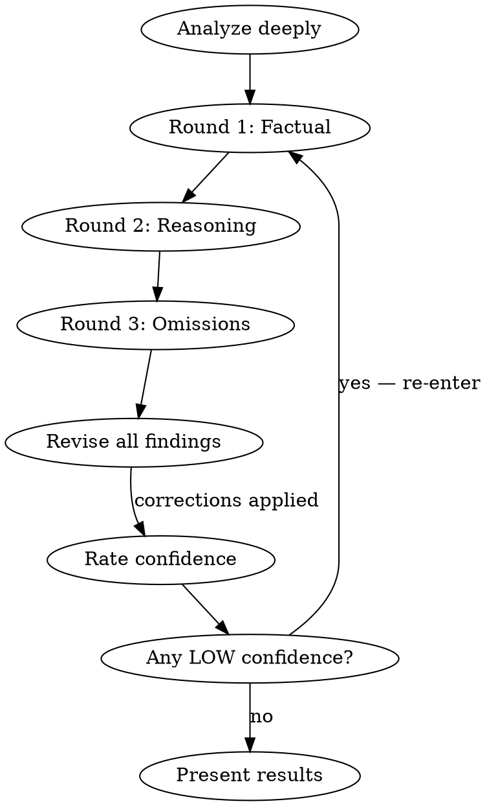

# Vet

Deep self-auditing analysis loop. Replaces the chain: "ultrathink, audit, vet, revise, repeat until confident."

Use: `/vet` after any analysis, recommendation, or claim — before presenting final results.
Also: `/vet <topic>` to audit a specific aspect (e.g., `/vet real-world results`).

## Protocol

You MUST complete all three audit rounds before presenting results. Do NOT skip rounds even if early rounds find nothing — later rounds catch different error classes.

### Round 1 — Factual Accuracy
- Cross-check every number against its source (file, output, doc)
- Verify provenance: do captions/headers match the actual data source?
- Flag data gaps explicitly — never paper over missing data
- Check for stale numbers (v6 where v7 expected, 20-rep where 50-rep claimed)

### Round 2 — Reasoning Quality
- Mark each claim as one of: **observed** (raw data), **tested** (p-value), or **inferred** (reasoning from data)
- Check for overclaiming: "the only place X happens" → is it really the only place?
- Check for underclaiming: did you miss a finding that strengthens or weakens the argument?
- Identify confounders in any cross-dataset or cross-experiment comparisons
- Soften language where evidence is incomplete

### Round 3 — Omissions
- What comparisons did you NOT make that a reviewer would ask about?
- What competing explanations exist for your findings?
- What data would change your conclusions if it came in differently?
- Are there systematic patterns you explored for one comparison but not others? (e.g., DASH vs SR but not DASH vs RS)

## Output Format

After all rounds, present findings with:

1. **Corrections applied** — list what changed from the initial analysis (with ⚠️ marker)
2. **Confidence ratings** — every finding gets HIGH / MEDIUM / LOW with one-line justification
3. **Open questions** — what can't be resolved with available data
4. **Data gaps** — what's missing and how it affects conclusions

## Red Flags — You're Rationalizing

| Thought | Reality |
|---------|---------|
| "This round found nothing, skip the next" | Different rounds catch different errors. Complete all three. |
| "The numbers look right, no need to cross-check" | The provenance error in Table 5 looked right too. Check the source. |
| "This claim is obviously true" | Obvious claims are where overclaiming hides. Verify. |
| "I'll note this is approximate" | Approximate is fine if labeled. Unlabeled approximation is an error. |
| "The user already knows this caveat" | Reviewers don't. State it. |
